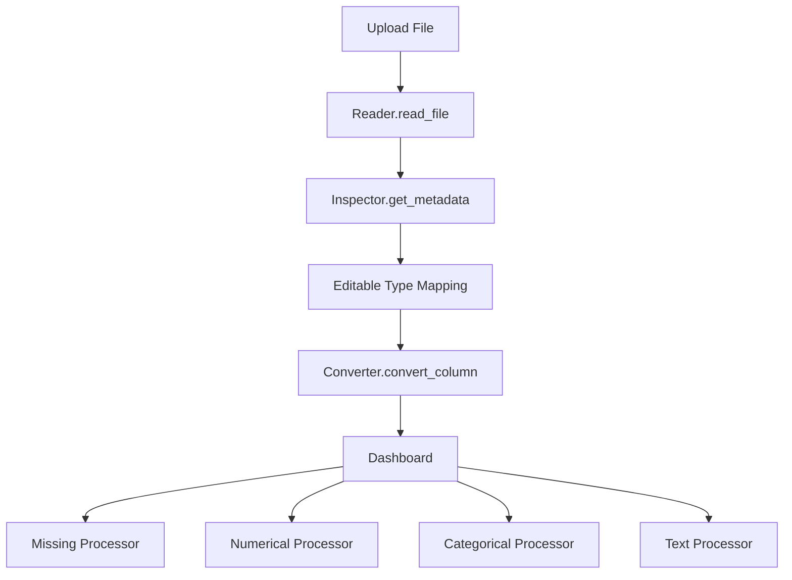

# EDA Tool

## Overview

EDA Tool is a Streamlit application for interactive exploratory data analysis on tabular datasets.
It focuses on quick inspection and visualization with a guided workflow:

1. Upload data.
2. Review auto-detected column types.
3. Adjust target types if needed.
4. Run conversion/validation.
5. Explore generated analysis panels.

## Responsibilities

- Read input files (`.csv`, `.xlsx`, `.json`, `.parquet`).
- Detect likely column types (`Numerical`, `Categorical`, `Text`, `Datetime`).
- Let users override type detection before analysis.
- Generate analysis views for missing values, numerical fields, categorical fields, and text.

## Architecture Overview

### Tech Stack

- Python `3.12+`
- Streamlit
- Pandas / NumPy
- Plotly / Matplotlib / WordCloud
- TextBlob

### Project Structure

```text
main.py                     # Streamlit entrypoint and UI flow
src/services/reader.py      # File loading (csv/xlsx/json/parquet)
src/services/inspector.py   # Metadata extraction and type classification
src/utils/converter.py      # Column conversion and validation
src/processors/numerical.py # Numerical charts + summary stats
src/processors/categorical.py # Categorical charts
src/processors/text.py      # Sentiment, n-grams, word cloud
src/processors/missing.py   # Missing-value report + chart
```

### Data Flow



## Development Setup

### Prerequisites

- Python `3.12` or newer
- `uv` (recommended) or `pip`

### Option A: Setup with uv (recommended)

```bash
uv sync
source .venv/bin/activate
```

### Option B: Setup with pip

```bash
python -m venv .venv
source .venv/bin/activate
pip install -e .
```

## Running the Application

From the project root:

```bash
streamlit run main.py
```

Default local URL:

- `http://localhost:8501`

## How to Use

1. Start the app and upload a dataset.
2. Review the raw data preview and detected types.
3. Edit target types where auto-detection is incorrect.
4. Click **Start EDA** to validate and convert columns.
5. Explore generated analysis sections:
   - Report summary and data quality metrics
   - Missing values table + bar chart
   - Numerical distribution and boxplot
   - Categorical bar and pie charts
   - Text sentiment, text length, n-grams, and word cloud

## Supported File Types

- CSV (`.csv`)
- Excel (`.xls`, `.xlsx`)
- JSON (`.json`)
- Parquet (`.parquet`)

## Notes and Current Limitations

- No automated test suite is currently defined in the repository.
- Datetime auto-detection attempts parsing for object columns and may coerce invalid values to `NaT`.
- Text n-gram chart logic currently computes frequencies from tokenized words (not strict n-gram tuples).

## Deployment / CI

No CI/CD pipeline configuration is currently present in this repository.
If you add one, document:

- Branch strategy
- Validation/lint/test steps
- Deployment target and commands
